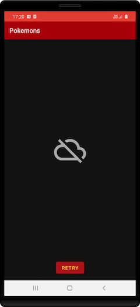

Android Pokemon
=================

* The application allows research on POKEAPI the pokemons and their main data.
* This search occurs through requests to the web service with the RETROFIT library.
* The MOCHI library is used to convert a string JSON into Kotlin objects.
* The pokemon image processing is performed by the library COIL.
* The pokemon list is displayed with PAGING, where it’s being used pages size 12.
* The project architecture is MVVM, with dependence injection HILT and various Android JETPACK libraries.
* There are automated tests to increase the quality of the application, where can be observed the following scenarios:
  * Screen navigation
  * GridLayout with Recyclerview
  * Screen with details of the Pokemon
  * Test for ViewModel

Architecture
-----------

Screenshots (not dark)
-----------

Screenshots (dark)
-----------

Libraries Used
--------------
* Architecture - MVVM
  * Jetpack
  * Lifecycles
  * LiveData
  * Flow
  * Navigation
  * ViewModel
  * Paging
  * Binding expressions
  * Data binding
  * View binding
  * Binding Adapters
  * Unit Tests
  * Instrumentation Tests
  * espresso
  * junit
* UI
  * Fragment
  * Layout
  * Material Design
  * RecyclerView
  * FragmentContainerView
  * ConstraintLayout
  * MaterialCardView
* Third party and miscellaneous libraries
  * Retrofit
  * Moshi
  * Coil
  * Hilt
  * Kotlin Coroutines
  * PokeAPI
  

Upcoming features
-----------------
* Search Pokemon
* Animations
* Include library Room